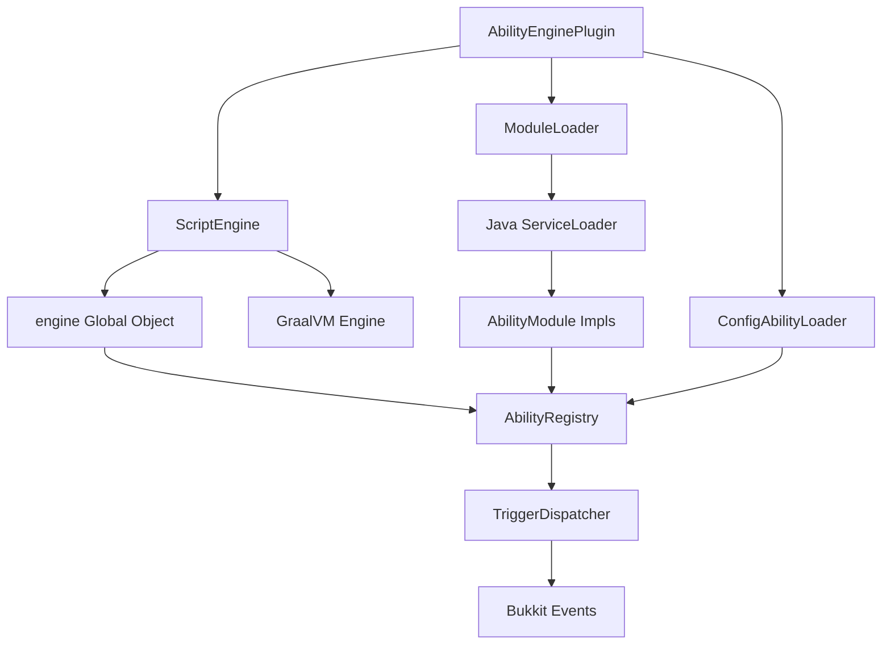

# AbilityEngine Architecture

## Overview

AbilityEngine is a modular Minecraft plugin framework built for Paper 1.21+ that enables developers, power users, and server owners to create custom abilities using multiple approaches: Java API, JavaScript scripting (Phase 2), or YAML configuration.

## Module Structure

AbilityEngine uses a Gradle multi-module architecture with the following modules:

### `ability-engine-api`

Public-facing API module containing all interfaces and data types. External modules and scripts interact with the engine through this API.

**Key Types:**

- `Ability` - Core interface for all abilities
- `AbilityContext` - Immutable record containing execution context (player, trigger, targets, event)
- `TriggerType` - Enum of supported triggers
- `Condition` - Functional interface for ability conditions
- `Conditions` - Static factory for common conditions
- `CooldownManager` - Per-player cooldown management
- `AbilitySession` - Interface for stateful abilities
- `AbilityRegistry` - O(1) ability lookup
- `AbilityItemService` - Create and manage ability-backed items
- `AbilityProvider` - SPI for external modules (Phase 2)

### `ability-engine-core`

Internal implementation of the engine. Contains all the runtime logic.

**Key Classes:**

- `AbilityRegistryImpl` - ConcurrentHashMap-based registry
- `CooldownManagerImpl` - Time-based cooldown tracking
- `TriggerDispatcher` - Event listener that resolves triggers and dispatches abilities
- `ConditionEvaluator` - Evaluates condition chains with AND logic
- `SessionManager` - Manages active sessions with tick loop
- `AbilityItemServiceImpl` - PDC-based item tagging
- `EventTriggerRegistry` - Advanced event-based trigger registration
- `BaseAbilitySession` - Base implementation for sessions

### `ability-engine-config`

YAML-based ability loader. Allows server owners to define abilities through configuration.

**Key Classes:**

- `ConfigAbilityLoader` - Parses YAML files and registers abilities
- `ConfigAbility` - Ability implementation that executes configured actions
- `ActionType` - Enum of built-in actions
- `ActionExecutor` - Interface for action execution
- Action implementations (SendMessageAction, LaunchProjectileAction, etc.)

### `ability-engine-plugin`

Paper plugin entrypoint. Wires everything together and provides commands.

**Key Classes:**

- `AbilityEnginePlugin` - Main plugin class (extends JavaPlugin)
- `AbilityCommand` - Command handler for `/ability` commands

## Dependency Graph

```
ability-engine-plugin
  ├─ ability-engine-api
  ├─ ability-engine-core
  │   └─ ability-engine-api
  └─ ability-engine-config
      ├─ ability-engine-api
      └─ ability-engine-core
```

Only `ability-engine-plugin` produces a final JAR (using Shadow plugin to shade all dependencies).

## Trigger System

### Standard Interaction Triggers

The engine supports preset interaction triggers that cover common use cases:

- `RIGHT_CLICK` / `LEFT_CLICK` - Basic interactions
- `SHIFT_RIGHT_CLICK` / `SHIFT_LEFT_CLICK` - Shift + interactions
- `RIGHT_CLICK_ENTITY` / `LEFT_CLICK_ENTITY` - Entity interactions
- `SHIFT_RIGHT_CLICK_ENTITY` / `SHIFT_LEFT_CLICK_ENTITY` - Shift + entity interactions
- `DAMAGE_DEALT` / `DAMAGE_TAKEN` - Combat triggers
- `MOVE` - Movement trigger
- `TICK` - Fires every tick (for active sessions)

### Trigger Resolution Flow

1. Bukkit event fires (PlayerInteractEvent, PlayerInteractEntityEvent, etc.)
2. `TriggerDispatcher` resolves the event to a `TriggerType` (including shift detection)
3. Checks held item for ability PDC tags
4. Finds abilities matching the trigger slot
5. Evaluates conditions (AND logic)
6. Checks cooldown
7. Executes ability
8. Sets cooldown

### Event-Based Triggers (Advanced)

For advanced use cases, abilities can register to fire on arbitrary Bukkit events via `EventTriggerRegistry`. This is the escape hatch for scripting (Phase 2) and custom Java modules.

## Item Binding System

Ability items are created using `PersistentDataContainer` (PDC) with the following keys:

- `ability_engine:ability_id` - Primary ability ID (legacy single-ability format)
- `ability_engine:abilities` - JSON array for multi-ability items
- `ability_engine:item_version` - Schema version

### Multi-Ability Items

Items can contain multiple abilities, each bound to a specific trigger slot:

```json
[
  {"id": "fireball", "trigger": "RIGHT_CLICK"},
  {"id": "shield", "trigger": "SHIFT_RIGHT_CLICK"}
]
```

When a trigger fires, the engine checks which abilities are bound to that specific trigger and only executes those.

## Condition System

Conditions are composable predicates evaluated against an `AbilityContext`. All conditions use AND logic by default.

**Built-in Conditions:**

- `sneaking()` / `notSneaking()`
- `holdingAbilityItem()`
- `healthAbove(threshold)` / `healthBelow(threshold)`
- `yAbove(y)` / `yBelow(y)`
- `hasTarget()`
- `cooldownReady(manager, abilityId)`

**Composing Conditions:**

- `and(Condition...)` - Combine with AND
- `or(Condition...)` - Combine with OR
- `not(Condition)` - Negate

## Cooldown System

Cooldowns are managed per-player and per-ability:

- Stored as UUID -> (AbilityID -> ExpiryTime) map
- Automatic expiry checking with cleanup
- Thread-safe using ConcurrentHashMap
- Zero-cost for abilities without cooldowns

## Session System

Sessions support stateful abilities that need continuous effects or tick-based logic:

- Each session is bound to a player and ability
- SessionManager runs a single repeating task (every tick)
- Sessions auto-cleanup on player quit or plugin disable
- Lifecycle: `start()` -> `tick()` (repeated) -> `end()`

Use cases: grappling hooks, channeling abilities, continuous pull effects, active auras.

## Performance Characteristics

- **O(1) ability lookup** - ConcurrentHashMap registry
- **O(1) item checking** - PDC reads are fast
- **Minimal event overhead** - Only processes events for players holding ability items
- **Automatic cleanup** - Sessions and cooldowns clean up expired entries
- **Thread-safe** - All core data structures use concurrent collections

## Thread Safety

- Ability execution always happens on the main thread
- Registry and cooldown manager are thread-safe
- Never call Bukkit APIs from async threads

## Security Model

- Scripts are trusted (no sandboxing)
- External modules are trusted
- All input validation happens at boundaries (commands, config)
- PDC keys are namespaced to prevent conflicts

## Phase 2 (Implemented)

Phase 2 adds JavaScript scripting and external module loading:

### `ability-engine-script`

JavaScript scripting system powered by GraalVM.

**Key Classes:**

- `ScriptEngine` - Orchestrates script loading, unloading, reloading with resource cleanup
- `ScriptContext` - Tracks resources per script (abilities, listeners, tasks)
- `EngineBinding` - The global `engine` object exposed to scripts
- `ScriptAbility` - Bridges JavaScript ability definitions to Java Ability interface
- `TriggerConstants` - Provides `engine.trigger.*` constants
- `ConditionBindings` - Provides `engine.condition.*` builders
- `SessionBindings` - Provides `engine.sessions.*` API

**Features:**

- Clean DSL for ability registration (`engine.ability()`)
- Raw Bukkit event listening (`engine.listen()`)
- Session management API
- Task scheduling
- Full Java interop via `Java.type()` (trusted scripts, no sandboxing)
- Hot reload support (per-script or all-at-once)
- Automatic resource cleanup (abilities, listeners, tasks)

**Script Location:** `plugins/AbilityEngine/scripts/*.js`

**Example Script:**

```javascript
engine.ability({
  id: "dash",
  triggers: ["SHIFT_RIGHT_CLICK"],
  cooldown: 5,
  execute: function(ctx) {
    ctx.player.setVelocity(ctx.player.getLocation().getDirection().multiply(2.5));
  }
});
```

### `ability-engine-module-loader`

External JAR module loading system using Java ServiceLoader SPI.

**Key Classes:**

- `ModuleLoader` - Scans modules directory, creates URLClassLoader per JAR, discovers providers
- `LoadedModule` - Tracks a loaded module (provider, classloader, ability IDs)
- `AbilityModule` (in api) - Interface extending AbilityProvider with `onEnable()`/`onDisable()` lifecycle

**Module Discovery:**

Modules must declare their provider in `META-INF/services/xyz.rishabhvenu.abilityengine.api.AbilityProvider`

**Lifecycle:**

1. Load JARs from `plugins/AbilityEngine/modules/`
2. Create URLClassLoader (parent: plugin classloader)
3. ServiceLoader discovers AbilityProvider implementations
4. If AbilityModule, call `onEnable(registry, cooldowns, items)`
5. Call `getAbilities()` and register all
6. On unload: unregister abilities, call `onDisable()`, close classloader

**Module Location:** `plugins/AbilityEngine/modules/*.jar`

### Phase 2 Commands

- `/ability reload` - Now reloads config abilities AND scripts
- `/ability script reload [filename]` - Reload specific script or all
- `/ability script list` - List loaded scripts
- `/ability module list` - List loaded external modules

### Phase 2 Architecture Diagram



### Scripting vs Config vs Java Modules

**Use Scripts When:**
- Fast iteration needed (hot reload)
- Logic changes frequently
- Server-specific customization
- Prototyping abilities

**Use Config When:**
- Non-developers create abilities
- Simple action-based abilities
- Data-driven content

**Use Java Modules When:**
- Complex logic
- Performance critical
- Reusable across servers
- Type safety required
- Large codebases

All three can coexist. Abilities from all sources are registered in the same registry.

## Phase 3 (Implemented)

Phase 3 adds six major runtime features for scripting:

### 1. Phase / State Machine API

Abilities can define multiple phases with lifecycle hooks:

```javascript
engine.ability({
  id: "example",
  phases: {
    charge: {
      duration: 20,
      onStart(ctx, phase) {},
      onTick(ctx, phase) {},
      endWhen(ctx, phase) { return false; },
      next: "release"
    },
    release: {
      onStart(ctx, phase) {},
      onEnd(ctx, phase) {}
    }
  }
});
```

- Each phase has tick counter, state storage (`phase.get/set`)
- Automatic transitions via `duration` or `endWhen()`
- `ctx.phase()` returns current phase instance

### 2. Raycast Utility

Synchronous raycasting with block and entity detection:

```javascript
engine.raycast({
  origin, direction, maxDistance,
  detect: ["BLOCK", "ENTITY"],
  entityRadius: 1.5,
  onHitBlock(hit) {},
  onHitEntity(hit) {},
  onMiss(endLocation) {}
});
```

Entity detection uses stepping algorithm to check along ray path.

### 3. Movement Module

Physics-safe entity movement with collision drag:

- `engine.movement.pull({entity, target, speed, drag, onArrival})`
- `engine.movement.dash({entity, direction, power})`
- `engine.movement.launch({entity, direction, power})`

All movement tasks tracked on execution instance for auto-cleanup.

### 4. Entity Control API

Freeze entities with movement suppression:

```javascript
engine.control.freeze(entity, {
  duration: 60,
  preventMovement: true,
  preventRotation: false
}, ctx.execution());
```

EntityControlManager intercepts movement events and zeros velocity. Auto-unfreezes on death/quit/duration.

### 5. Cooldown Override API

Dynamic cooldown modification:

- `ctx.overrideCooldown(seconds)` - Set new cooldown
- `ctx.shortenCooldown(percent)` - Reduce by percentage

Both sync with boss bar UI automatically.

### 6. Interrupt System

Abilities can be interrupted by events:

```javascript
engine.ability({
  id: "channeled",
  interrupts: ["TAKE_DAMAGE", "SWITCH_ITEM", "DEATH", "QUIT"],
  onInterrupt(ctx) {
    // Cleanup logic
  }
});
```

InterruptManager listens for events and cancels matching executions. All execution-owned resources (tasks, frozen entities, phases) auto-cleanup.

### Execution Instance Architecture

Each `execute()` invocation creates an `AbilityExecutionInstance` that owns:
- Scheduled tasks (phases, movement)
- Frozen entities
- Phase state

On interrupt or completion, all resources are automatically cleaned up.

