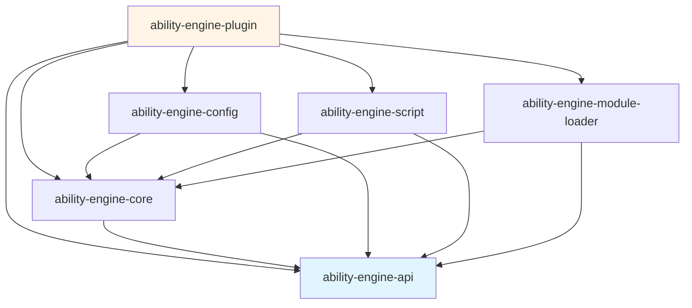
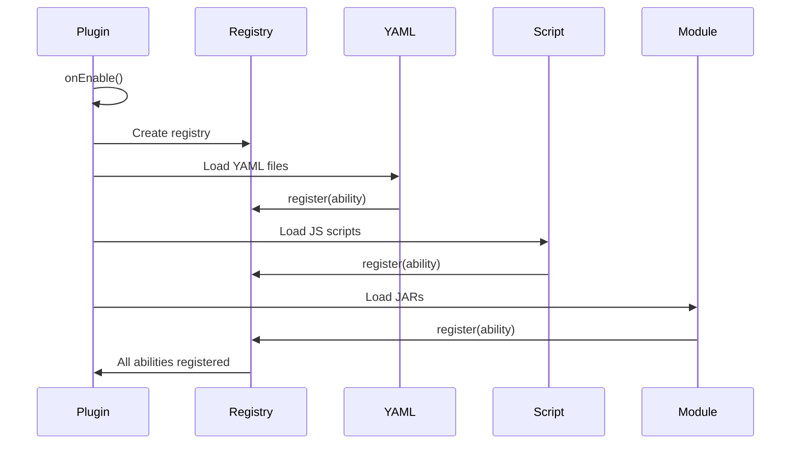
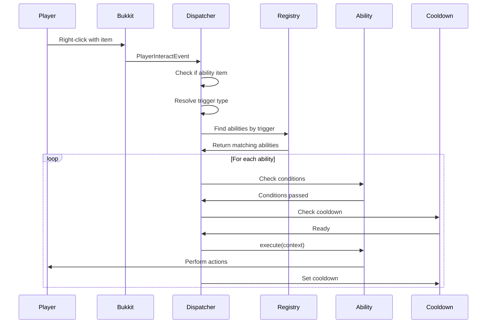
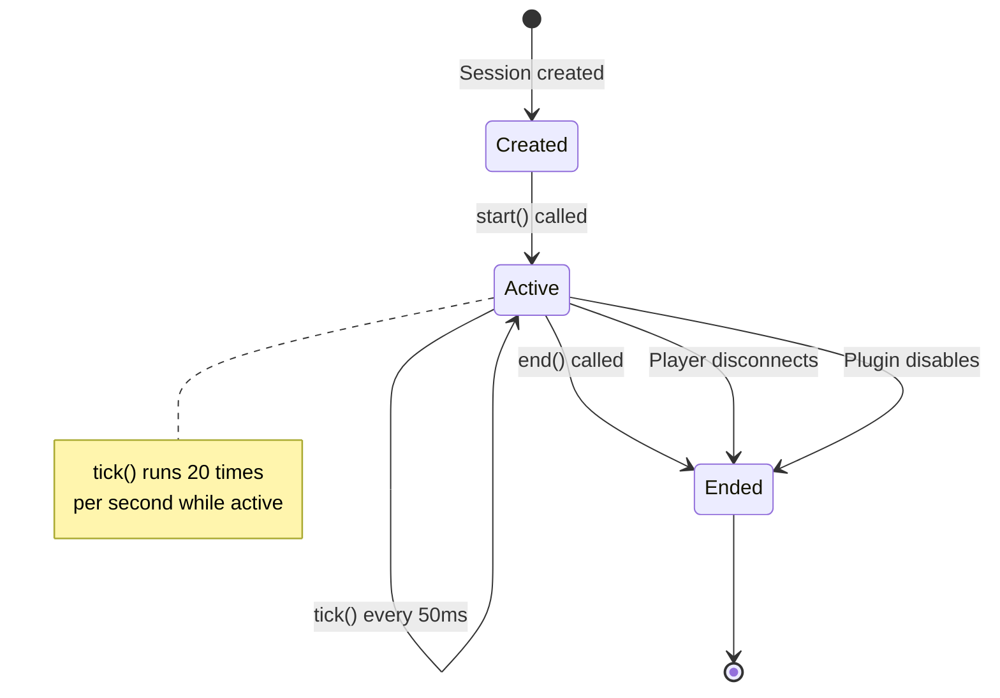
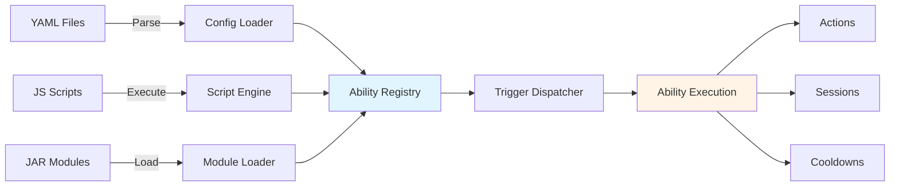

# Architecture Overview

Understanding AbilityEngine's modular architecture and design.

---

## Module Structure

AbilityEngine uses a clean multi-module architecture:

---

## Module Descriptions

### ability-engine-api

**Public API module** - Contains all interfaces and data types.

**Key Types**:

- `Ability` - Core ability interface
- `AbilityContext` - Execution context record
- `TriggerType` - Trigger types enum
- `Condition` - Condition functional interface
- `AbilityRegistry` - Registry interface
- `CooldownManager` - Cooldown management
- `AbilitySession` - Session interface
- `AbilityItemService` - Item service
- `AbilityProvider` / `AbilityModule` - SPI interfaces

**Dependencies**: None (only Paper API)

---

### ability-engine-core

**Internal implementation** - Contains all runtime logic.

**Key Classes**:

- `AbilityRegistryImpl` - ConcurrentHashMap-based registry
- `CooldownManagerImpl` - Time-based cooldown tracking
- `TriggerDispatcher` - Event listener and trigger resolution
- `SessionManager` - Session lifecycle management
- `AbilityItemServiceImpl` - PDC-based item tagging

**Dependencies**: ability-engine-api

---

### ability-engine-config

**YAML ability loader** - Parses YAML files and creates abilities.

**Key Classes**:

- `ConfigAbilityLoader` - YAML parser
- `ConfigAbility` - YAML-backed ability implementation
- `ActionType` - Enum of built-in actions
- 11 action implementations (SendMessageAction, LaunchProjectileAction, etc.)

**Dependencies**: ability-engine-api, ability-engine-core, SnakeYAML 2.2

---

### ability-engine-script

**JavaScript scripting system** - GraalVM-powered scripting.

**Key Classes**:

- `ScriptEngine` - Script orchestration and lifecycle
- `ScriptContext` - Per-script resource tracking
- `EngineBinding` - Global `engine` object API
- `ScriptAbility` - JS-to-Java ability bridge
- Binding helpers (TriggerConstants, ConditionBindings, SessionBindings)

**Dependencies**: ability-engine-api, ability-engine-core, GraalVM Polyglot 24.1.1

---

### ability-engine-module-loader

**External JAR module loading** - ServiceLoader SPI integration.

**Key Classes**:

- `ModuleLoader` - JAR scanning and ServiceLoader integration
- `LoadedModule` - Module tracking record

**Dependencies**: ability-engine-api, ability-engine-core

---

### ability-engine-plugin

**Paper plugin entrypoint** - Wires everything together.

**Key Classes**:

- `AbilityEnginePlugin` - Main plugin class
- `AbilityCommand` - Command handler

**Dependencies**: All other modules

---

## Ability Registration Flow

---

## Trigger Execution Flow

---

## Session Lifecycle

---

## Data Flow

---

## Performance Characteristics

### Registry

- **Lookup**: O(1) via ConcurrentHashMap
- **Thread-safe**: Yes
- **Concurrent access**: Supported

### Cooldowns

- **Check**: O(1) lookup
- **Cleanup**: Lazy (on next access)
- **Thread-safe**: Yes

### Triggers

- **Event processing**: O(n) where n = abilities with matching trigger
- **Optimization**: Only processes ability items
- **Impact**: Minimal for most servers

### Sessions

- **Tick loop**: Single task for all sessions
- **Overhead**: ~1ms per tick for 100 sessions
- **Cleanup**: Automatic on player quit

---

## Security Model

### Trust Boundaries

1. **YAML abilities** - Trusted (server owner controls files)
2. **JavaScript scripts** - Trusted (no sandboxing, full Java access)
3. **JAR modules** - Trusted (ServiceLoader, full access)
4. **Player input** - Untrusted (validated at boundaries)

### Input Validation

- Command arguments validated
- Config files parsed safely
- PDC data validated on read
- No SQL injection (no SQL used)

---

## Extension Points

### For Server Owners

- **YAML configuration** - `plugins/AbilityEngine/abilities/*.yml`
- No coding required

### For Scripters

- **JavaScript files** - `plugins/AbilityEngine/scripts/*.js`
- Hot reload supported
- Full Bukkit API access

### For Developers

- **External JARs** - `plugins/AbilityEngine/modules/*.jar`
- Implement `AbilityProvider` or `AbilityModule`
- ServiceLoader SPI discovery

---

## Design Principles

### Modularity

Clean separation between API, implementation, and extensions.

### Performance

- O(1) lookups where possible
- Concurrent data structures
- Lazy cleanup
- Minimal event overhead

### Extensibility

Multiple ways to add abilities:

- YAML (easiest)
- JavaScript (flexible)
- Java modules (most powerful)

### Safety

- Thread-safe by default
- Automatic resource cleanup
- Fail-safe error handling

---

## Thread Model

### Main Thread

- All Bukkit API calls
- Ability execution
- Trigger dispatching
- Session ticking

### Async Operations

Not used (everything on main thread for safety)

---

## Memory Management

### Abilities

- Registered once, reused for all players
- Immutable implementations recommended

### Cooldowns

- Per-player, per-ability
- Automatic cleanup on expiry
- Cleared on player quit

### Sessions

- Active sessions only
- Automatic cleanup on end/disconnect

---

## See Also

- [Internals](internals.md) - Implementation details
- [Module Development](../guides/module-development.md) - Creating modules
- [API Reference](../reference/api/ability.md) - API documentation
